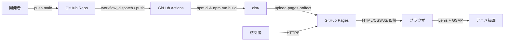
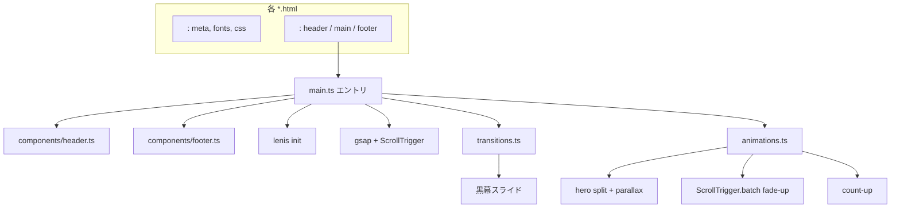
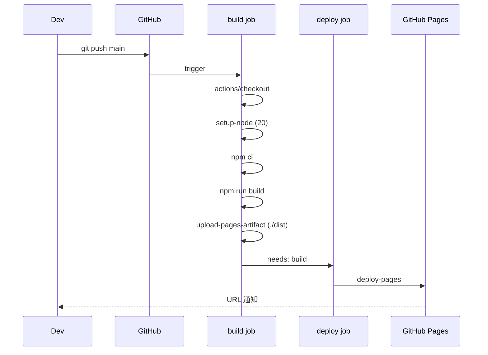
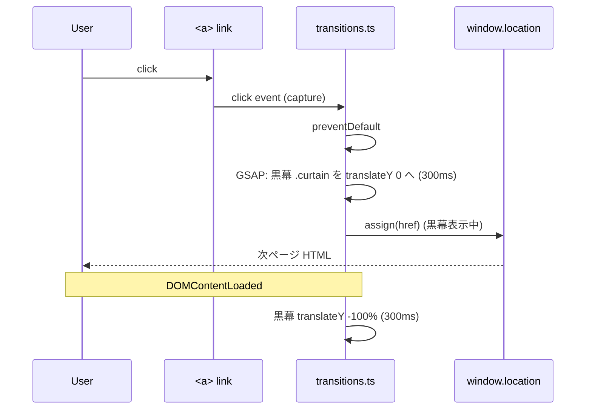

# 神山まるごと高専 紹介サイト 設計書 (design.md)

## 1. アーキテクチャ概観

静的 Multi-Page Application。Vite がエントリポイント (`*.html`) ごとにバンドルし、共通スクリプト/スタイルを ESM で取り込む。GitHub Actions が `npm run build` → `dist/` を Pages に upload。



### 1.1 実行時アーキテクチャ (ブラウザ内)



## 2. ディレクトリ構成

```
ghcp-school-intro-mei/
├─ index.html
├─ about.html
├─ curriculum.html
├─ campus.html
├─ admissions.html
├─ vite.config.ts
├─ tsconfig.json
├─ package.json
├─ .gitignore
├─ README.md
├─ .github/
│  └─ workflows/deploy.yml
├─ public/
│  ├─ favicon.svg
│  └─ images/...(モノクロ画像)
└─ src/
   ├─ main.ts                # 全ページ共通エントリ
   ├─ components/
   │  ├─ header.ts           # mountHeader(target)
   │  └─ footer.ts           # mountFooter(target)
   ├─ scripts/
   │  ├─ animations.ts       # GSAP / ScrollTrigger
   │  ├─ transitions.ts      # ページ遷移幕
   │  ├─ lenis.ts            # Lenis init + ScrollTrigger 連携
   │  └─ a11y.ts             # prefers-reduced-motion ヘルパ
   ├─ data/
   │  └─ school.ts           # 学校情報シングルソース
   ├─ pages/
   │  ├─ index.ts            # トップ固有 (hero split, counter)
   │  ├─ about.ts
   │  ├─ curriculum.ts
   │  ├─ campus.ts
   │  └─ admissions.ts
   └─ styles/
      ├─ variables.css
      ├─ reset.css
      ├─ global.css
      └─ pages/
         ├─ index.css
         ├─ about.css
         ├─ curriculum.css
         ├─ campus.css
         └─ admissions.css
```

## 3. 主要モジュールのインタフェース

### 3.1 `src/data/school.ts`

```ts
export interface SchoolInfo {
  name: string;            // 神山まるごと高専
  nameEn: string;          // Kamiyama Marugoto College of Technology
  established: number;     // 2023
  location: { prefecture: string; city: string; address: string };
  mission: string;
  pillars: { title: string; description: string }[]; // デザイン/エンジニアリング/起業家精神
  scholarship: { title: string; summary: string; conditions: string[] };
  admissions: { type: string; schedule: string }[];
  sns: { name: 'X' | 'Instagram' | 'YouTube' | 'Facebook'; url: string }[];
  // TODO(Q-03): 公式取得不可項目はユーザ確認
}

export const SCHOOL: SchoolInfo;
```

### 3.2 `src/components/header.ts` / `footer.ts`

```ts
export function mountHeader(root: HTMLElement, opts?: { activePath?: string }): void;
export function mountFooter(root: HTMLElement): void;
```

- HTML 文字列を `innerHTML` で注入。`activePath` で現在ページの nav リンクに `aria-current="page"`。

### 3.3 `src/scripts/lenis.ts`

```ts
export function initLenis(): import('lenis').default;
// Lenis を起動し、ScrollTrigger.update を raf に同期する
```

### 3.4 `src/scripts/animations.ts`

```ts
export function initGlobalAnimations(): void; // ScrollTrigger.batch fade-up, magnetic, image hover
export function initHero(target: HTMLElement): void; // split + parallax
export function initCountUp(scope: ParentNode): void;
```

### 3.5 `src/scripts/transitions.ts`

```ts
export function initPageTransitions(): void;
// 内部: 同一オリジンの <a> をクリック横取り → 黒幕 in → location.assign → DOMContentLoaded で黒幕 out
```

### 3.6 `src/scripts/a11y.ts`

```ts
export const prefersReducedMotion: () => boolean;
export function whenMotionAllowed(fn: () => void): void;
```

### 3.7 `src/main.ts` (擬似コード)

```ts
import './styles/variables.css';
import './styles/reset.css';
import './styles/global.css';
import { mountHeader } from './components/header';
import { mountFooter } from './components/footer';
import { initLenis } from './scripts/lenis';
import { initGlobalAnimations } from './scripts/animations';
import { initPageTransitions } from './scripts/transitions';
import { whenMotionAllowed } from './scripts/a11y';

mountHeader(document.querySelector('[data-header]')!, { activePath: location.pathname });
mountFooter(document.querySelector('[data-footer]')!);
whenMotionAllowed(() => {
  initLenis();
  initGlobalAnimations();
  initPageTransitions();
});
```

## 4. ビルド構成 (`vite.config.ts`)

```ts
import { defineConfig } from 'vite';
import { resolve } from 'node:path';

export default defineConfig({
  base: '/ghcp-school-intro-mei/',
  build: {
    rollupOptions: {
      input: {
        index: resolve(__dirname, 'index.html'),
        about: resolve(__dirname, 'about.html'),
        curriculum: resolve(__dirname, 'curriculum.html'),
        campus: resolve(__dirname, 'campus.html'),
        admissions: resolve(__dirname, 'admissions.html'),
      },
    },
  },
});
```

## 5. CI/CD (`.github/workflows/deploy.yml`)



- `permissions: pages: write, id-token: write`
- `concurrency: pages` で同時実行制御
- `actions/configure-pages@v5` / `actions/upload-pages-artifact@v3` / `actions/deploy-pages@v4`

## 6. データフロー: ページ遷移トランジション



## 7. エラーハンドリング行列

| エラー | 検出箇所 | 対応 |
| --- | --- | --- |
| Lenis 初期化失敗 | `lenis.ts` try/catch | console.warn + ネイティブスクロールにフォールバック |
| GSAP プラグイン未登録 | `animations.ts` | `gsap.registerPlugin(ScrollTrigger)` を冒頭で必ず実行 |
| 画像 404 | `` | プレースホルダ (黒矩形) に差し替え、`alt` は維持 |
| 公式情報未取得 | `school.ts` | `// TODO(Q-XX)` コメント + プレースホルダ文字列 |
| ページ遷移失敗 (offsite link) | `transitions.ts` | 同一オリジン以外/`target="_blank"`/`download` は素通り |
| `prefers-reduced-motion` | `a11y.ts` | アニメ初期化を全スキップ、CSS で `transition: none` |

## 8. テスト戦略

- **単体テスト**: 本プロジェクトはビューが大半なので最小限。`a11y.ts` の `prefersReducedMotion` のみ Vitest でユニットテスト (任意)。
- **手動検証**:
  - DevTools デバイスモード 360 / 768 / 1024 / 1440px
  - DevTools Performance パネルでスクロール録画 → fps 確認
  - DevTools Rendering の "Emulate CSS prefers-reduced-motion: reduce"
  - Lighthouse: Performance / Accessibility / Best Practices / SEO 計測
- **E2E**: スコープ外 (静的サイトのため省略)。

## 9. 採用判断 (Decision Records)

### Decision - 2026-04-22T00:00:00Z (技術スタック)
- **Decision**: Vite vanilla-ts + GSAP + Lenis を採用
- **Context**: 5 ページの紹介サイト、リッチアニメ要件、GitHub Pages 静的配信
- **Options**:
  - (a) Astro: SSG・MPA に強いが学習コスト + GSAP との連携設計が増える
  - (b) Next.js export: SPA/MPA 切替は可能だが過剰、Pages との相性も追加設定要
  - (c) **Vite vanilla-ts**: 設定がシンプル、multi-page も `rollupOptions.input` で素直
- **Rationale**: 学習コストとビルドサイズが最小、Pages デプロイ実績豊富
- **Impact**: フレームワーク機能 (ルーティング、データフェッチ) は自前実装が必要
- **Review**: ページ数が 10 を超える、または CMS 連携が発生したら再検討

### Decision - 2026-04-22T00:00:01Z (Multi-Page vs SPA)
- **Decision**: Multi-Page (静的 HTML × 5)
- **Rationale**: SEO 対策、初回表示の軽量化、Pages の素直な配信
- **Impact**: ページ間共通要素を JS で注入するため、初回 paint で空のヘッダ/フッタが見える可能性 → CSS で領域確保しレイアウトシフト回避
- **Review**: ページ間遷移がもっと複雑化したら SPA + History API へ移行検討

### Decision - 2026-04-22T00:00:02Z (アクセシビリティ優先)
- **Decision**: `prefers-reduced-motion` 対応を必須化、CSS と JS 両面で抑制
- **Rationale**: アニメ全部盛りでも WCAG 準拠を確保
- **Impact**: アニメ初期化前の分岐が必須、テストケースも追加

## 10. 段階的実装戦略 (Confidence 78% → PoC ファースト)

1. **PoC (Phase 1 + 3 抜粋)**: 基盤 + 共通レイアウト + `index.html` の Hero だけで一度デプロイし、Pages で動作確認。
2. **拡張**: `about` → `curriculum` → `campus` → `admissions` の順で並列追加。
3. **仕上げ**: パフォ/アクセシビリティ/レスポンシブ調整。

## 11. 未解決事項 → DESIGN への影響

- **Q-01 画像権利**: 不確定 → 当面は `public/images/` に **プレースホルダ (黒グラデ + テキスト)** を配置し、後でフリー素材に差し替え。
- **Q-02 リポジトリ名**: 維持前提で `base` を固定。リネーム時は `vite.config.ts` の `base` と Actions の URL を変更するだけで対応可。
- **Q-03 公式情報**: `school.ts` を **TODO コメント付きプレースホルダ** で立ち上げ、取得後に値だけ差し替えできる形にする。
